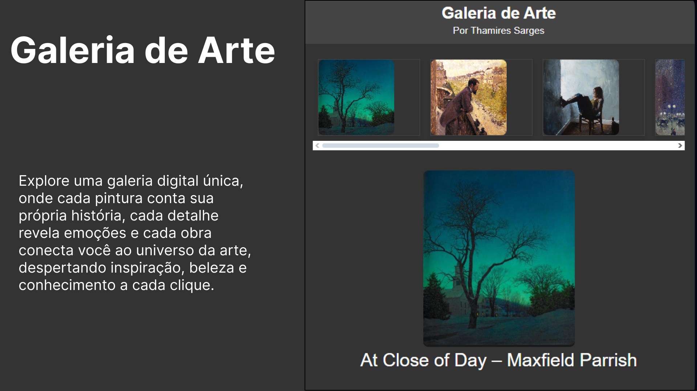

# 🎨 Arte em Foco – Galeria Interativa

Este projeto foi desenvolvido como parte do curso **“JavaScript do Básico ao Avançado + 132 Projetos Reais”** do **Clevison Santos**. A ideia principal é criar uma **galeria digital interativa**, onde o usuário pode explorar obras de arte, clicar nas imagens para vê-las em destaque e conferir informações sobre cada pintura e seu autor. 

## Funcionalidades

- Navegação horizontal pelas obras de arte 🖌️
- Clique em qualquer pintura para ver em destaque e ler a descrição 📖
- Interface simples e responsiva, ideal para desktop e dispositivos móveis 💻📱
- Prática de conceitos de **JavaScript**, como manipulação do DOM e eventos ⚡

## Tecnologias Utilizadas

- HTML5
- CSS3
- JavaScript (ES6)

## 🌐 Acesse a Galeria Online

Veja o projeto funcionando no GitHub Pages:  
[Clique aqui para acessar](https://thamiressarges.github.io/galeria-de-arte)

---

Projeto criado para fins de aprendizado e prática durante o curso, com foco em desenvolvimento web e interatividade. 

